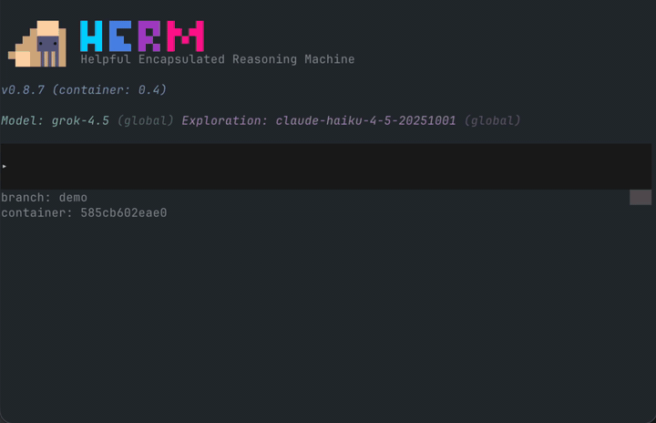

# herm

[](https://github.com/aduermael/herm/actions/workflows/test.yml)
[](https://github.com/aduermael/herm/actions/workflows/prompt-length.yml)
[](https://github.com/aduermael/herm/actions/workflows/ci-checks.yml)

Herm is a model-agnostic, general-purpose AI agent built for safe, flexible execution. It natively supports multiple isolation methods (containers, in-process Unix-like sandboxes, and host sandboxes such as `sandbox_exec` on macOS or `bubblewrap` on Linux). 

The Herm CLI defaults to containers with self-building environments, so you can run anything safely without approval interruptions.

The logo and mascot is a hermit crab called Herm, representing the hermetic nature of the agent. 🐚

## Herm CLI



**Containerized by default:** Use the CLI on your host, the agent itself runs inside Docker containers and can only access files from your current work directory. No permission prompts.

**Multi-provider** — Anthropic, OpenAI, Gemini, Grok, OpenRouter, Ollama, Azure OpenAI, Vertex AI, or Bedrock… You can mix and match models, like Grok as main agent, Haiku for exploration and Gemini for vision.

**Self-building dev environments** — Herm extends container environments by writing Dockerfiles dynamically. Environments are scoped per project (current work directory).

**100% open-source** — Everything is open: system prompts, skills, tools. No hidden instructions, no black boxes. You can fork it to make it your own. 

### Requirements

- macOS or Linux (arm64 and amd64)
- Docker (through [Docker Desktop](https://www.docker.com/products/docker-desktop/) or [OrbStack](https://orbstack.dev)) when using default container based isolation

### Install

Use the install method that suits you:

```sh
curl -fsSL https://hermagent.com/install.sh | sh
```

```sh
brew tap aduermael/herm
brew install herm
```

Or read instructions to [build from source](#).

### Run

```
herm
```

## Herm app for iOS/macOS

**TODO**

## Roadmap

Rough priority order, subject to change.

1. **Benchmarks:** measure herm against Claude Code, Codex, Grok Build and other coding agents.
2. **PR review bot:** Herm bot (Github Action) that reviews pull requests.
3. **Safe connectivity:** Let herm talk to external APIs and databases without ever seeing your credentials. (We’ll probably use [SFAE](https://sfae.io) for this)

## Project Structure

```
herm/
├── cmd/
│   ├── herm/                  Main application
│   │   ├── prompts/           System prompt templates (embedded)
│   │   └── dockerfiles/       Base container definition (embedded)
│   └── debug/                 Debug utilities
├── scripts/                   Build helpers
├── .herm/
│   └── skills/                Skill definitions (e.g. devenv)
├── external/
│   ├── langdag/               langdag submodule
│   └── cpsl/                  CPSL backend submodule
├── .herm-cpsl/                Ignored CPSL build artifacts and cache
├── img/                       Demo assets
├── CPSL_BUILD.md              Native CPSL local sandbox build guide
├── CONTRIBUTING.md            Contributor setup, standards, and PR guide
├── go.mod
├── LICENSE
└── README.md
```

## Contributing

See [`CONTRIBUTING.md`](CONTRIBUTING.md) for setup, tests, CI checks, coding standards, and pull request expectations.

## Community

Join the [Discord](https://discord.gg/WFjcymwtZU) to chat, ask questions, or share feedback.

## License

[MIT](LICENSE)
